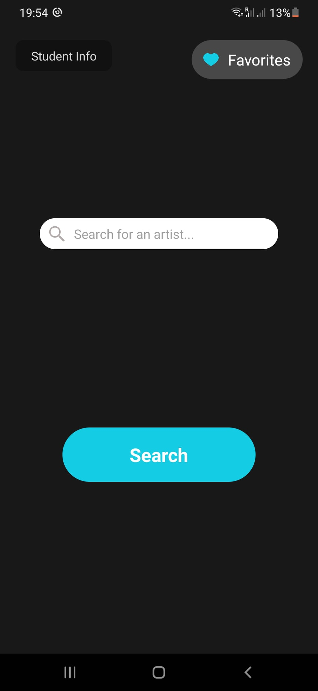
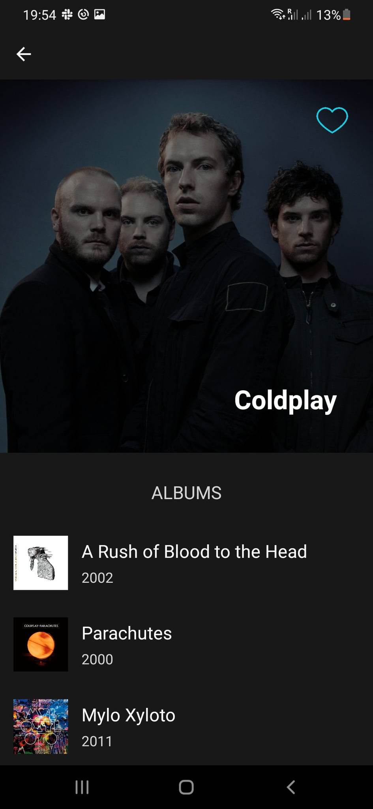
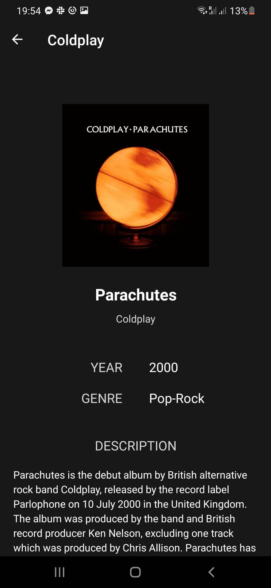
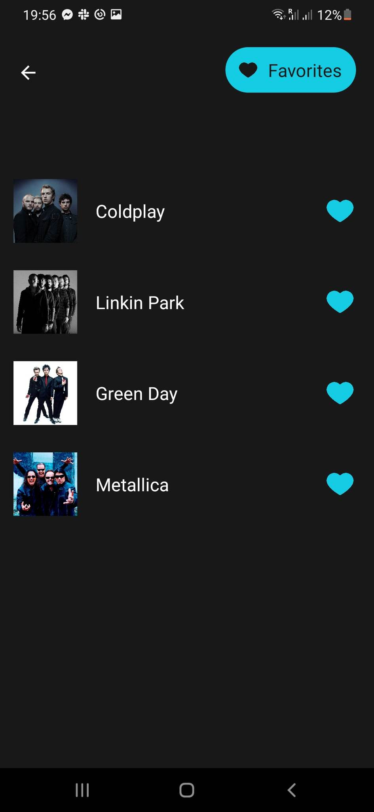

## Human-Computer Interaction 2021SS - Project

This is a mobile application that allows users to search for bands and explore their different albums. The app's main goal is to help users find information about a specific musician, including relevant metadata about the artist and their albums and display it to the user.

### Components

The app is composed of three main components:

-   A start page that includes a search field for users to enter the name of the musician/band they are looking for.
    
-   Querying the musician and all associated albums through TheAudioDB API.
    
-   A display screen showing the metadata (title, image, year, genre, and description) of the albums in a meaningful layout.
    
-   Users can save the musician for later and this list is accessible from the start page.
    

### Dependencies

-   React Native with Expo
-   TheAudioDB API
